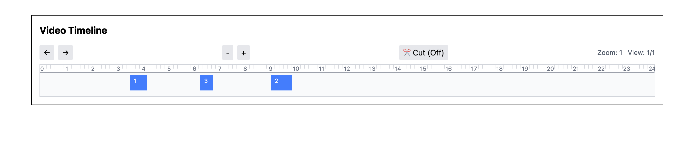

# 🎬 video_player

A minimal yet powerful video player with interactive timeline, zoom, and precise cut/download support.

---

## ✨ Features

- ⏱ **Interactive Timeline**
  - Four zoom levels: 24hr, 12hr, 6hr, 1hr
  - Scroll left/right using arrows
  - Dynamic hour & minute tick marks
  - Hover marker shows full date & time (`YYYY-MM-DD HH:mm:ss`)
  - Selected time marker with red line and tooltip

- ✂️ **Cut Mode**
  - Toggle cut mode to select clips
  - Click twice to define start & end of cut
  - Only allows cuts within valid video regions
  - Visual overlay for selected segments
  - "Cancel Cut" button to clear all selections

- 🎞 **Video Segments**
  - Dynamically rendered based on input data
  - Scales and positions correctly at any zoom level

- 🖥 **Responsive UI**
  - Clean dark-themed timeline design
  - Horizontal scroll for full-day views
  - Supports hover, click, and selection interactions

---

## 📸 Preview



> *Example of 24-hour view with hover and selected time marker.*

---

## 📦 Sample Input JSON

```json
[
  {
    "start": "2025-10-07T08:15:00",
    "end": "2025-10-07T10:45:00"
  },
  {
    "start": "2025-10-07T14:30:00",
    "end": "2025-10-07T17:00:00"
  }
]
